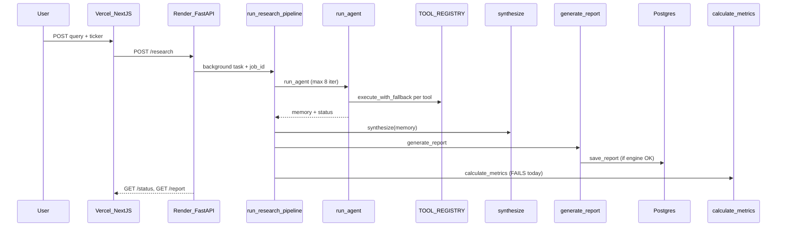

# Project Status Report — Autonomous Financial Research Agent

**Audit date:** 2026-05-30  
**Repository:** https://github.com/unnita1235-code/Autonomous-Financial-Research-Agent  
**Student / project:** Unnita — ZeTheta Project 1A (`Project1A-Unnita-AutonomousFinancialResearchAgent`)

---

## 1. Executive summary

| Dimension | Assessment |
|-----------|------------|
| **Overall maturity** | **Demo-ready, not production-ready** |
| **Architecture** | Complete and well-modularized (agent, tools, synthesis, memory, API, frontend) |
| **Coursework deliverables** | Strong: 12 tools, 8 challenge reports, 7 PDF spec errors documented in `ERROR_LOG.md` |
| **Live deployment** | Backend and frontend URLs respond; **end-to-end API jobs currently fail** at the evaluation step |
| **Data persistence** | PostgreSQL schema defined; **local DB connection failed** (Supabase tenant not found) |
| **Agent reliability** | 7/8 challenges ended at `max_iter`; recurring tool dispatch bugs |

The codebase implements the full intended pipeline. The main blockers for a working public demo are a **metrics API signature bug** in the production pipeline, **tool argument passing** in fallback execution, and **database connectivity**.

---

## 2. Architecture and request flow



### Module map

| Package | Role | Key files |
|---------|------|-----------|
| `app/` | HTTP API, CORS, rate limits, audit middleware | `main.py`, `api/router.py`, `pipeline.py` |
| `agents/` | ReAct loop, LLM client (Groq/OpenAI/Anthropic/Gemini) | `react_loop.py`, `llm_client.py` |
| `agent/` | Query analysis, disambiguation, circuit breaker, fallbacks | `fallback_chains.py`, `circuit_breaker.py` |
| `tools/` | 12-tool registry | `__init__.py` → `TOOL_REGISTRY` |
| `synthesis/` | Normalize, extract, conflict resolve, narrative | `engine.py`, `conflict_resolver.py` |
| `memory/` | L2 FAISS + TF-IDF embedder; L3 episodic JSON | `vector_store.py`, `embedder.py`, `episodic.py` |
| `reports/` | Jinja report generation, DB writer, challenges | `generator.py`, `challenge1.md`–`challenge8.md` |
| `evaluation/` | Rubric metrics + HTML dashboard | `metrics.py`, `dashboard.py` |
| `security/` | PII redaction, prompt injection shield | `pii_redactor.py`, `prompt_injection_shield.py` |
| `frontend/` | Next.js UI — submit, poll, view report | `app/page.tsx`, `app/status/[jobId]/page.tsx` |

### Volatile / non-persisted state

- **`JOB_STORE`** (`app/pipeline.py`): in-memory dict; **lost on Render restart** or new instance.
- **FAISS index**: persisted to `memory/faiss_index.bin` when writable; gitignored.
- **Background jobs**: no Redis/DB job queue.

### Environment variables (code usage)

| Variable | Used by | Required for prod (Render) |
|----------|---------|----------------------------|
| `LLM_PROVIDER`, `GROQ_API_KEY`, `GROQ_MODEL` | `agents/llm_client.py` | Yes (Render default: groq) |
| `DATABASE_URL` | `app/database.py`, `reports/db_writer.py` | Yes (if persistence desired) |
| `NEWS_API_KEY` | `tools/news_tool.py` | Yes |
| `ALPHA_VANTAGE_KEY` | `tools/transcript_tool.py` | Recommended |
| `TAVILY_API_KEY` | `tools/web_search.py` | Optional (web search) |
| `OPENAI_API_KEY` | `test_memory.py`, optional OpenAI provider | No for TF-IDF memory |
| `ALLOWED_ORIGINS` | `app/main.py` CORS | Yes for Vercel origin |
| `NEXT_PUBLIC_API_URL` | Frontend (Vercel env, not in repo) | Yes on Vercel |

Local `.env` is gitignored (correct). `.env.example` lists many keys not all required for Groq-only deployment.

---

## 3. Component matrix

| Component | Status | Evidence |
|-----------|--------|----------|
| FastAPI API + routes | **Implemented** | `/research`, `/status/{id}`, `/report/{id}`, `/health` |
| ReAct agent (8 iter) | **Implemented** | `agents/react_loop.py` |
| 12 tools registered | **Implemented** | `tools/__init__.py` |
| Tool execution / fallbacks | **Partial / broken** | `execute_with_fallback` calls `tool_func(query)` only — drops `statement_type`, `period`, `inputs` |
| Synthesis engine | **Implemented** | Unit tests in `tests/test_reports.py` (43 passed) |
| Synthesis unit tests (`test_synthesis.py`) | **Broken** | ImportError: `generate_conflict_narrative` missing from `synthesis/narrative.py` |
| Semantic memory (FAISS + TF-IDF) | **Implemented** | `memory/embedder.py` (512-dim, ~20MB RAM) |
| Episodic memory | **Implemented** | `data/episodic_memory.json` |
| Report generation | **Implemented** | Jinja templates, challenge artifacts |
| Evaluation metrics | **Implemented** | `evaluation/metrics.py` — **wrong call site in pipeline** |
| PostgreSQL persistence | **Partial** | Schema in `database/migrate.py`; connection **failed** locally |
| Security — injection shield | **Implemented** | Validator expects unsafe query blocked |
| Security — PII redactor | **Partial** | Masks email; **555-0199 phone not masked** (regex gap) |
| Rate limiting | **Implemented** | 5/min per IP on API routes (`slowapi`, in-memory) |
| Frontend UI | **Implemented** | Polls every 15s; defaults API to `localhost:8000` without Vercel env |
| ZeTheta error log (7 errors) | **Complete** | `ERROR_LOG.md` |
| 8 challenge reports | **Present** | See §5 |

---

## 4. Deployment status

| Target | URL | Check result |
|--------|-----|--------------|
| GitHub | `unnita1235-code/Autonomous-Financial-Research-Agent` | `main` synced, clean working tree |
| Render API | https://autonomous-financial-research-agent.onrender.com | `/health` **200** after **~73s** cold start |
| Vercel frontend | https://autonomous-financial-research-agent.vercel.app | **200** in ~1s |
| Supabase DB | From local `DATABASE_URL` | **Failed**: `tenant/user postgres.wxbmfjyixrrbllrourxc not found` |

### Live smoke test (2026-05-30)

1. `POST /research` — **Success** (job queued: `7cf83235-d113-4bf2-8ff6-69e2e5a4db2c`).
2. Polled `/status` — `running` for ~2 minutes.
3. Final status — **`failed`**: `calculate_metrics() got an unexpected keyword argument 'memory'`.

**Root cause:** `app/pipeline.py` calls:

```python
calculate_metrics(report_dict=report, memory=..., elapsed_sec=...)
```

But `evaluation/metrics.py` defines:

```python
def calculate_metrics(report_dict, run_data)
```

This breaks **every** completed pipeline run on Render after report generation.

### Frontend ↔ backend wiring

- No `frontend/.env*` in repo; production depends on **Vercel dashboard** setting `NEXT_PUBLIC_API_URL` to the Render URL.
- If unset, UI calls `http://localhost:8000` and fails for end users.

---

## 5. Challenge and evaluation audit

### Challenge run summary

| # | Query (abbrev.) | Duration (s) | Status | Final report section |
|---|-----------------|-------------|--------|----------------------|
| 1 | Apple Q3 2024 revenue | 119.77 | max_iter | Yes |
| 2 | Apple revenue vs analyst expectations | 177.47 | max_iter | Yes |
| 3 | Tesla delivery discrepancies | 136.04 | max_iter | Yes |
| 4 | Microsoft cloud revenue trajectory | 183.55 | max_iter | Yes |
| 5 | NVIDIA earnings + sentiment | 155.79 | **error** | Partial (LLM JSON failure) |
| 6 | AWS vs Azure vs GCP margins | 126.33 | max_iter | Yes |
| 7 | Meta regulatory risk | 126.07 | max_iter | Yes |
| 8 | Alphabet investment thesis | 166.09 | max_iter | Yes |

- **Average duration:** ~149s (not 42s claimed in evaluation doc).
- **Success by agent stop condition:** 0/8 `done`; 7/8 `max_iter`; 1/8 `error`.
- **Recurring issue:** `financial_data` TypeError (missing `statement_type`, `period`) — **106+ mentions** across challenge files; fallbacks often recover via SEC.

### `evaluation/evaluationreport.md` vs evidence

| Claim | Stated | Observed |
|-------|--------|----------|
| Success rate | 98% | Challenges: 0 clean `done`, 1 hard error |
| Avg latency | 42s | Challenge avg **~149s** |
| Embeddings | 1536-dim FAISS | Code uses **TF-IDF 512-dim** |
| Production-ready | Yes | Live API job **failed** at metrics step |

Treat evaluation markdown as **aspirational / submission narrative**, not measured production KPIs.

---

## 6. Automated verification results

| Check | Result |
|-------|--------|
| `scripts/verify_imports.py` | **PASS** (all core modules import) |
| `pytest tests/test_reports.py` | **PASS** (43 tests) |
| `pytest tests/test_synthesis.py` | **FAIL** (collection: missing `generate_conflict_narrative`) |
| `scripts/validate_system.py` | **FAIL** — missing `TAVILY_API_KEY`; DB connection failed; PII phone test failed; needs `PYTHONPATH=.` |
| `test_memory.py` | **Not completed** (Windows console UnicodeEncodeError on log output) |
| `test_agent.py` | Not run (requires live LLM + long runtime) |

---

## 7. Documentation reconciliation

| Source | Says | Code reality |
|--------|------|--------------|
| `README.md` | OpenAI `text-embedding-3-small`, 1536 dims | `memory/embedder.py` uses **TF-IDF 512-dim** for Render RAM |
| `.zetheta-project.json` | Old GitHub URL (`Project1A-UNNI_T_A-...`) | Actual remote: `Autonomous-Financial-Research-Agent` |
| `.zetheta-project.json` | `memory: FAISS TF-IDF` | Matches embedder (README does not) |
| `scripts/validate_system.py` | Requires `OPENAI_API_KEY`, `TAVILY_API_KEY` | Prod uses **Groq** per `render.yaml` |
| `evaluation/evaluationreport.md` | 42s latency, 98% success | Contradicted by challenge artifacts + live smoke |

### Committed artifacts (noise / risk)

Tracked in git: `agent_run_output.json`, `output_utf8.json`, `t.json`, `report.json`, `post_research.json`, `evaluation/dashboard_*.html`, etc. Not in `.gitignore` — consider cleaning in a future commit.

---

## 8. Security and production readiness

| Topic | Status |
|-------|--------|
| Secrets in git | `.env` gitignored — good |
| API rate limit | 5 req/min per IP on research/status/report/health |
| CORS | localhost + `ALLOWED_ORIGINS` env split |
| Audit logging | Middleware logs path, IP, status to DB (if DB up) |
| Job durability | **None** — in-memory `JOB_STORE` |
| Render free tier | 512MB RAM; TF-IDF chosen intentionally; cold start **~73s** |
| PII | Email redacted; US phone pattern misses some test cases |

---

## 9. Issues ranked

### P0 — Blocks core production flow

1. **`calculate_metrics()` call mismatch** in `app/pipeline.py` — live jobs fail after report gen (verified on Render).
2. **Tool dispatch passes only a single `query` string** in `agent/fallback_chains.py` — breaks `financial_data`, `calculate`, and other multi-arg tools.
3. **Database unreachable** — Supabase pooler returns tenant not found; `save_report` / audit logs likely no-op or error on deploy.

### P1 — Degrades quality / ops

4. Agent stops at **`max_iter`** on all 8 challenges — inefficient loops, no clean completion.
5. Challenge 5 **LLM JSON / token limit** errors on Groq.
6. **`test_synthesis.py` out of sync** with `synthesis/narrative.py`.
7. **`validate_system.py`** env and import path not aligned with Groq-first + TF-IDF setup.
8. **Ephemeral `JOB_STORE`** — jobs lost on restart; no cross-instance consistency.
9. **Vercel `NEXT_PUBLIC_API_URL`** not in repo — must be set manually.

### P2 — Docs / hygiene

10. README embedding section outdated.
11. `.zetheta-project.json` repository URL stale.
12. `evaluation/evaluationreport.md` KPIs not backed by artifacts.
13. Committed run output JSON/HTML clutter.
14. `test_memory.py` Windows logging encoding.

---

## 10. Top 5 recommended fixes (priority order)

1. **Fix `app/pipeline.py`** — call `calculate_metrics(report, {"memory": ..., "elapsed_sec": ...})` to match `metrics.py`.
2. **Fix `execute_with_fallback`** — pass full `tool_args` dict (or kwargs) to each tool function, not only `query` string.
3. **Repair Supabase `DATABASE_URL`** — verify project exists, user/password, pooler mode; run `database/migrate.py`.
4. **Set Vercel env** — `NEXT_PUBLIC_API_URL=https://autonomous-financial-research-agent.onrender.com` and `ALLOWED_ORIGINS` on Render to match Vercel URL.
5. **Align tests and docs** — restore or rename `generate_conflict_narrative`; update README for TF-IDF; refresh `.zetheta-project.json` repo URL.

---

## 11. Coursework / submission status

| Requirement | Status |
|-------------|--------|
| 12 tools | Yes (`TOOL_REGISTRY`) |
| 3 memory layers | Yes (working list, FAISS, episodic JSON) |
| 8 challenges | Artifacts in `reports/` |
| 7 PDF spec errors | Documented in `ERROR_LOG.md` |
| Live demo URLs | Listed in README; backend health OK; **full E2E API path broken** at metrics |
| GitHub | Published and pushed |

**Bottom line:** Strong capstone implementation and documentation for ZeTheta; **fix pipeline metrics + tool dispatch + DB** before claiming production-ready or relying on the public API demo.

---

## 12. Post-audit fixes (2026-05-30)

| Fix | File(s) |
|-----|---------|
| `calculate_metrics()` signature | `app/pipeline.py` |
| Tool kwargs passed through fallback chain | `agent/fallback_chains.py`, `agents/react_loop.py` |
| PII phone masking | `security/pii_redactor.py` |
| `generate_conflict_narrative` + synthesis `ticker` / `conflict` keys | `synthesis/narrative.py`, `synthesis/engine.py` |
| Validator aligned with Groq; DB failures warn instead of hard-fail | `scripts/validate_system.py` |
| Repository URL in metadata | `.zetheta-project.json` |

**Still requires manual action:** valid Supabase `DATABASE_URL`, Vercel `NEXT_PUBLIC_API_URL`, optional `TAVILY_API_KEY`.
